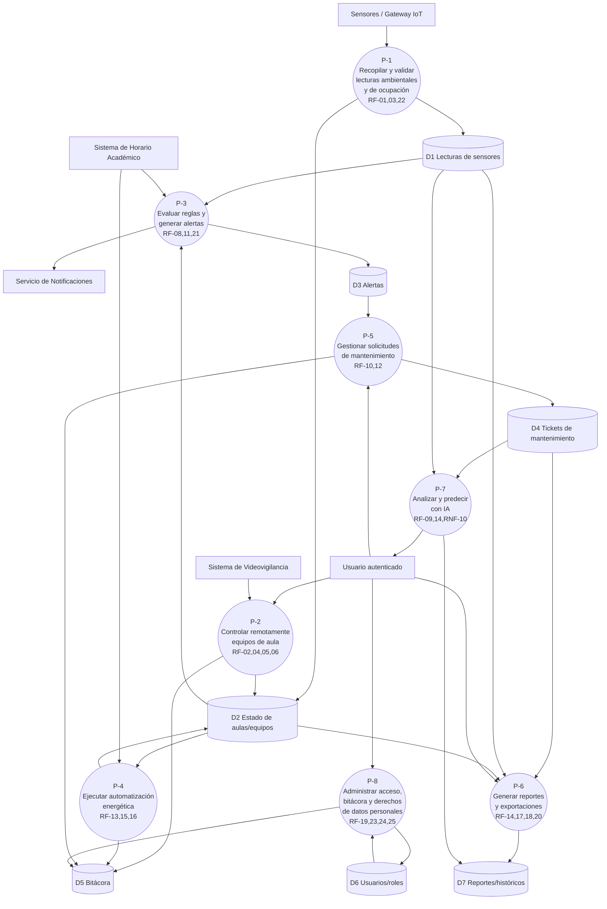

# DFD Nivel 1 — SIGA (nuevo en PE5)

**Por qué existe:** la matriz de trazabilidad exige una columna "Proceso DFD" para cerrar la cadena RF→CU→Clase→**Proceso DFD**→Estado→BDD→CP (M4_ade). El ERS nunca tuvo un DFD — la sección IV es "Modelado del sistema (UML) completo" y el diagrama de componentes no es un DFD (describe módulos de software, no flujo de datos entre procesos y almacenes). Este DFD se deriva de los RF y CU ya existentes, agrupándolos por función, no inventa ningún dato nuevo.

**Entidades externas:** Sensores/Gateway IoT, Usuario (Docente/Infraestructura/TI/Administrativo/Autoridades), Sistema de Horario Académico, Sistema de Videovigilancia, Servicio de Notificaciones.

**Almacenes de datos:** D1 Lecturas de sensores, D2 Estado de aulas/equipos, D3 Alertas, D4 Tickets de mantenimiento, D5 Bitácora, D6 Usuarios/roles, D7 Reportes/históricos.

## Diagrama (Mermaid)

## Tabla de procesos

| Proceso | Nombre | RF cubiertos | Entradas | Salidas |
|---|---|---|---|---|
| P-1 | Recopilar y validar lecturas ambientales y de ocupación | RF-01, RF-03, RF-22 | Lecturas de Sensores/Gateway IoT | D1 (lecturas), D2 (estado) |
| P-2 | Controlar remotamente equipos de aula | RF-02, RF-04, RF-05, RF-06 | Comando de Usuario, flujo de Sistema de Videovigilancia | D2 (estado), D5 (bitácora) |
| P-3 | Evaluar reglas y generar alertas | RF-08, RF-11, RF-21 | D1, D2, Sistema de Horario Académico | D3 (alertas), notificación a Servicio de Notificaciones |
| P-4 | Ejecutar automatización energética | RF-13, RF-15, RF-16 | D2, Sistema de Horario Académico | D2 (actualizado), D5 (bitácora) |
| P-5 | Gestionar solicitudes de mantenimiento | RF-10, RF-12 | Usuario, D3 (alertas que generan ticket) | D4 (tickets), D5 (bitácora) |
| P-6 | Generar reportes y exportaciones | RF-14, RF-17, RF-18, RF-20 | D1, D2, D4, Usuario (filtros) | D7 (reportes) |
| P-7 | Analizar y predecir con IA | RF-09, RF-14, RNF-10 (explicabilidad) | D1, D4 (históricos) | D7, explicación al Usuario |
| P-8 | Administrar acceso, bitácora y derechos de datos personales | RF-19, RF-23, RF-24, RF-25 | Usuario (credenciales/solicitud) | D6 (usuarios/roles), D5 (bitácora) |

**Nota:** este DFD es un artefacto nuevo de PE5, derivado de RF/CU ya validados en entregas previas — no introduce ninguna funcionalidad nueva, solo la representa como flujo de datos. Debe insertarse en el ERS como sección 4.11 "Diagrama de flujo de datos (DFD) — Nivel 1" y referenciarse en la matriz de trazabilidad (columna "Proceso DFD").
